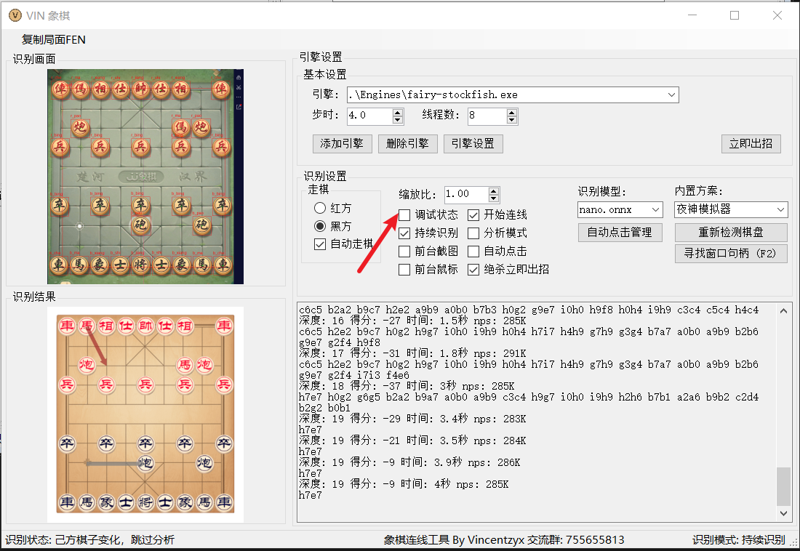
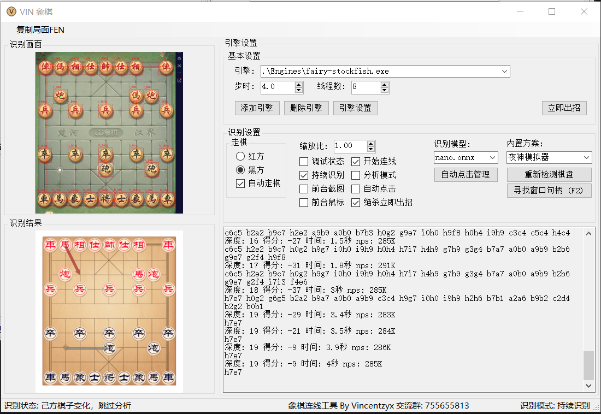
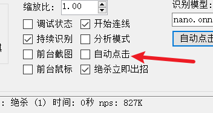

# VinXiangQi
基于Yolov5的中国象棋连线工具

模型训练集中天天象棋的样本较多，其他棋盘的识别效果不一定好。

目前仅测试过天天象棋和JJ象棋，JJ象棋因为等待时有动画，所以识别效果不是很理想。

该程序当前阶段只是一个想法验证，还缺少许多功能，**希望有人能加入一起完善**！
#### 交流群：755655813

## 使用方法

#### 1、创建方案或使用内置方案

方案是TXT格式的文件，储存在 程序根目录/Solutions 文件夹内，内容为：

1. 用于截图的窗口类名或者标题

2. 用于点击的子窗口类名或者标题（可留空，则截图和点击的为同一窗体）

   内置方案示例如下

   ./Solutions/JJ象棋_棋力评测/window.txt

   ``` 
   截图标题=中国象棋棋力评测
   截图类=
   点击标题=TKMCGame
   点击类=
   ```

   ./Solutions/天天象棋/window.txt

   ``` 
   截图标题=
   截图类=QQChess
   点击标题=
   点击类=
   ```

3. 也可以点击寻找窗口句柄按钮，在点击按钮2秒内把鼠标移至目标窗口上方，来获取窗口句柄。


#### 2、确认窗体缩放比 

1. 选中你想要使用的方案

2. 勾选调试模式

   

3. 根据左上角截图清空调整缩放比：如果截图显示不全，则增大缩放比；如果截图存在黑边，就减小缩放比，直到窗口完美覆盖图片。

4. 关闭调试状态

#### 3、开始下棋

​	1.勾选自动走棋

​	2.对于等待中没有动画的棋盘（如天天象棋）则关闭持续识别模式；对于等待中存在动画的棋盘（如JJ象棋）则打开持续识别模式

​	3.打开象棋对局

​	4.这时连线应该已经自动开始了，如没有开始，则点击重新检测棋盘来刷新



#### 4、自动续盘

因为用户存在不同分辨率和不同缩放比，自动续盘需要点击的按钮需要用户自行截取

##### 1. 点击 “自动点击管理”


管理界面如下


##### 2. 在右侧图片上点击

第一次确定左上坐标，第二次确定右下坐标


框好后有绿色框框指示

**请注意：请务必在识别的范围内尽量减小框选范围，不要选择整个按钮，这样可以提升检测效率。**

##### 3. 保存图片

点击保存即可保存该自动点击图片


##### 4. 勾选自动点击



启用自动点击后，即可自动点击保存截图中的按钮，进行自动续盘

## 异常情况

对于后台截图出现黑屏的窗体（如浏览器）可勾选前台截图，前台截图方式要求目标窗体前不能有遮挡。

对于不能点击的情况，可以勾选前台鼠标，该方式占用鼠标进行点击，为通用方法。

如使用过程中出现停止分析（持续识别模式时有概率出现），则点击重新检测棋盘来检测。
